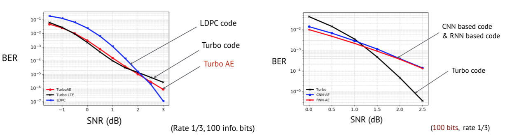

# Turbo AE
[New on 03/16/2022] We find a bug on the test function (the performance is measured on fixed noise rather than random noise), with updated test function, the BER can improve for at least 0.5dB. The result in the paper doesn't move much. So we can still trust the paper's result.

Turbo Autoencoder code for paper: `Y. Jiang, H. Kim, H. Asnani, S. Kannan, S. Oh, P. Viswanath, "Turbo Autoencoder: Deep learning based channel code for point-to-point communication channels" Conference on Neural Information Processing Systems (NeurIPS), Vancouver, December 2019` 

At medium block length, we can achieve comparable performance to near-optimal codes such as LDPC, Polar, and Turbo Code, solely via gradient descent! 

**If you use CNN and RNN as encoder and decoder, you can only get below graph right.**

**Use interleaving and iterative decoding, as well as the algorithm shown in more detail in paper, you can have below graph left.**

Required library: test on Python 3.6.11+ PyTorch 1.0.

If feel inspired, please consider cite:

    @inproceedings{jiang2019turbo,
      title={Turbo Autoencoder: Deep learning based channel codes for point-to-point communication channels},
      author={Jiang, Yihan and Kim, Hyeji and Asnani, Himanshu and Kannan, Sreeram and Oh, Sewoong and Viswanath, Pramod},
      booktitle={Advances in Neural Information Processing Systems},
      pages={2754--2764},
      year={2019}
    }

Also support DeepTurbo for paper: `Y. Jiang, H. Kim, H. Asnani, S. Kannan, S. Oh, P. Viswanath, "Deep Turbo: Deep Turbo Decoder", SPAWC 2019`, Support for DeepTurbo (Neural Turbo Code Decoder) is out. The TurboAE decoder RNN version is actually DeepTurbo.
:

    @article{Jiang2019DEEPTURBODT,
      title={DEEPTURBO: Deep Turbo Decoder},
      author={Yihan Jiang and Hyeji Kim and Himanshu Asnani and Sreeram Kannan and Sewoong Oh and Pramod Viswanath},
      journal={2019 IEEE 20th International Workshop on Signal Processing Advances in Wireless Communications (SPAWC)},
      year={2019},
      pages={1-5}
    }

Feel free to ask me any question! yij021@uw.edu

# What is new (01/15/2019): 
## 1. Camera ready paper is on [Arxiv](https://arxiv.org/abs/1911.03038)
Here is the [Slides](https://github.com/yihanjiang/turboae/blob/master/docs/TurboAE_slides.pdf), presented by Dr. Hyeji Kim in Allerton Conference.
I am working on the poster, and the poster will be out shortly. The plot result .py files will be out soon.

## 2. Code Support for [DeepTurbo](https://arxiv.org/abs/1903.02295) is out.
Ongoing progress to replicate DeepTurbo result on TurboAE framework.

## 2. Pre-trained model under refining. 
Current *.pt in './models/' are not the best model. (But you can fine-tune them easily) 

## 3. A document for guiding replicate results from scratch is [here](https://github.com/yihanjiang/turboae/blob/master/docs/howtos.md)

## 4. Experimental: I find using DenseNet is better than just CNN-1D. Will update code very soon.
The performance is even exceeding the result in paper, which I am verifying.

## 5. Experimental: Interleaver Optimization.
Glad to try the suggestion got from NeurIPS: optimize the interleaver. I do find a few random interleavers show quite different performance. I am working on it now.

# Run experiment for Turbo AE:

Before running, run 'mkdir ./logs/' to put folder for logs.

(1) Test pre-trained model, just enforce `-num_epoch 0`:

    CUDA_VISIBLE_DEVICES=0 python3.6 main.py -encoder TurboAE_rate3_cnn -decoder TurboAE_rate3_cnn -enc_num_unit 100 -enc_num_layer 2 -dec_num_unit 100 -dec_num_layer 5 -num_iter_ft 5 -channel awgn -num_train_dec 5 -num_train_enc 1 -code_rate_k 1 -code_rate_n 3 -train_enc_channel_low 2.0 -train_enc_channel_high 2.0  -snr_test_start -1.5 -snr_test_end 4.0 -snr_points 12 -num_iteration 6 -is_parallel 1 -train_dec_channel_low -1.5 -train_dec_channel_high 2.0 -is_same_interleaver 1 -dec_lr 0.0001 -enc_lr 0.0001 -num_block 50000 -batch_size 500 -train_channel_mode block_norm -test_channel_mode block_norm -num_epoch 100 --print_test_traj -loss bce -init_nw_weight ./models/dta_cont_cnn2_cnn5_enctrain2_dectrainneg15_2.pt -num_epoch 0

Note: I find using `-enc_num_layer 5` is much better than `-enc_num_layer 2`. I am working on STE of this.

    CUDA_VISIBLE_DEVICES=3 python3.6 main.py -encoder TurboAE_rate3_cnn -decoder TurboAE_rate3_cnn -enc_num_unit 100 -enc_num_layer 5 -enc_kernel_size 5  -dec_num_layer 5 -dec_num_unit 100 -dec_kernel_size 5 -num_iter_ft 5 -channel awgn -num_train_dec 5 -num_train_enc 1 -code_rate_k 1 -code_rate_n 3 -train_enc_channel_low 1.0 -train_enc_channel_high 1.0 -snr_test_start -1.5 -snr_test_end 4.0 -snr_points 12 -num_iteration 6 -is_parallel 1 -train_dec_channel_low -1.5 -train_dec_channel_high 2.0 -is_same_interleaver 1 -dec_lr 0.00005 -enc_lr 0.00005 -num_block 100000 -batch_size 1000 -train_channel_mode block_norm -test_channel_mode block_norm  -num_epoch 500 --print_test_traj -loss bce -optimizer adam -init_nw_weight ./models/enc5_dec5_cont_1dBenc.pt -num_epoch 0

(2) Train from scratch: Expect to run for 1-1.5 days on Nvidia 1080Ti.

    CUDA_VISIBLE_DEVICES=0 python3.6 main.py -encoder TurboAE_rate3_cnn -decoder TurboAE_rate3_cnn -enc_num_unit 100 -enc_num_layer 2 -dec_num_unit 100 -dec_num_layer 5 -num_iter_ft 5 -channel awgn -num_train_dec 5 -num_train_enc 1 -code_rate_k 1 -code_rate_n 3 -train_enc_channel_low 2.0 -train_enc_channel_high 2.0  -snr_test_start -1.5 -snr_test_end 4.0 -snr_points 12 -num_iteration 6 -is_parallel 1 -train_dec_channel_low -1.5 -train_dec_channel_high 2.0 -is_same_interleaver 1 -dec_lr 0.0001 -enc_lr 0.0001 -num_block 50000 -batch_size 500 -train_channel_mode block_norm -test_channel_mode block_norm -num_epoch 100 --print_test_traj -loss bce 

(3) Fine-tune on trained model:

    CUDA_VISIBLE_DEVICES=0 python3.6 main.py -encoder TurboAE_rate3_cnn -decoder TurboAE_rate3_cnn -enc_num_unit 100 -enc_num_layer 2 -dec_num_unit 100 -dec_num_layer 5 -num_iter_ft 5 -channel awgn -num_train_dec 5 -num_train_enc 1 -code_rate_k 1 -code_rate_n 3 -train_enc_channel_low 2.0 -train_enc_channel_high 2.0  -snr_test_start -1.5 -snr_test_end 4.0 -snr_points 12 -num_iteration 6 -is_parallel 1 -train_dec_channel_low -1.5 -train_dec_channel_high 2.0 -is_same_interleaver 1 -dec_lr 0.0001 -enc_lr 0.0001 -num_block 50000 -batch_size 500 -train_channel_mode block_norm -test_channel_mode block_norm -num_epoch 100 --print_test_traj -loss bce -init_nw_weight ./models/dta_cont_cnn2_cnn5_enctrain2_dectrainneg15_2.pt

(4) Using binarized code via STE:

    CUDA_VISIBLE_DEVICES=0 python3.6 main.py -encoder TurboAE_rate3_cnn -decoder TurboAE_rate3_cnn -enc_num_unit 100 -enc_num_layer 2 -dec_num_unit 100 -dec_num_layer 5 -num_iter_ft 5 -channel awgn -num_train_dec 5 -num_train_enc 1 -code_rate_k 1 -code_rate_n 3 -train_enc_channel_low 2.0 -train_enc_channel_high 2.0  -snr_test_start -1.5 -snr_test_end 4.0 -snr_points 12 -num_iteration 6 -is_parallel 1 -train_dec_channel_low -1.5 -train_dec_channel_high 2.0 -is_same_interleaver 1 -dec_lr 0.0001 -enc_lr 0.0001 -num_block 50000 -batch_size 500 -train_channel_mode block_norm_ste -test_channel_mode block_norm_ste -num_epoch 100 --print_test_traj -loss bce -init_nw_weight ./models/dta_step2_cnn2_cnn5_enctrain2_dectrainneg15_2.pt

Note that `block_norm_ste` will enforce this.

# Run experiment for DeepTurbo

(1) Train DeepTurbo with DeepTurbo-RNN:

    CUDA_VISIBLE_DEVICES=0 python3.6 main.py -encoder Turbo_rate3_757 -decoder TurboAE_rate3_rnn -dec_num_unit 100 -dec_num_layer 5 -num_iter_ft 5 -channel awgn -num_train_dec 5 -code_rate_k 1 -code_rate_n 3   -snr_test_start -1.5 -snr_test_end 4.0 -snr_points 12 -num_iteration 6 -is_parallel 1 -train_dec_channel_low -1.5 -train_dec_channel_high 2.0  -is_same_interleaver 1 -dec_lr 0.0001 -num_block 10000 -batch_size 100 -block_len 100 -num_epoch 200 --print_test_traj

(2) Train DeepTurbo with DeepTurbo-CNN:
 
    CUDA_VISIBLE_DEVICES=0 python3.6 main.py -encoder Turbo_rate3_757 -decoder TurboAE_rate3_cnn -dec_num_unit 100 -dec_num_layer 5 -num_iter_ft 5 -channel awgn -num_train_dec 5 -code_rate_k 1 -code_rate_n 3   -snr_test_start -1.5 -snr_test_end 4.0 -snr_points 12 -num_iteration 6 -is_parallel 1 -train_dec_channel_low -1.5 -train_dec_channel_high 2.0  -is_same_interleaver 1 -dec_lr 0.0001 -num_block 10000 -batch_size 100 -block_len 100 -num_epoch 200 --print_test_traj

You probably need to fine-tune on this model, e.g.increase the batch size, reduce the learning rate, and so on. 
As original DeepTurbo is not conducted under this framework, I am not sure if this will replicate what paper shows easily.
I am `actively` working on this.
