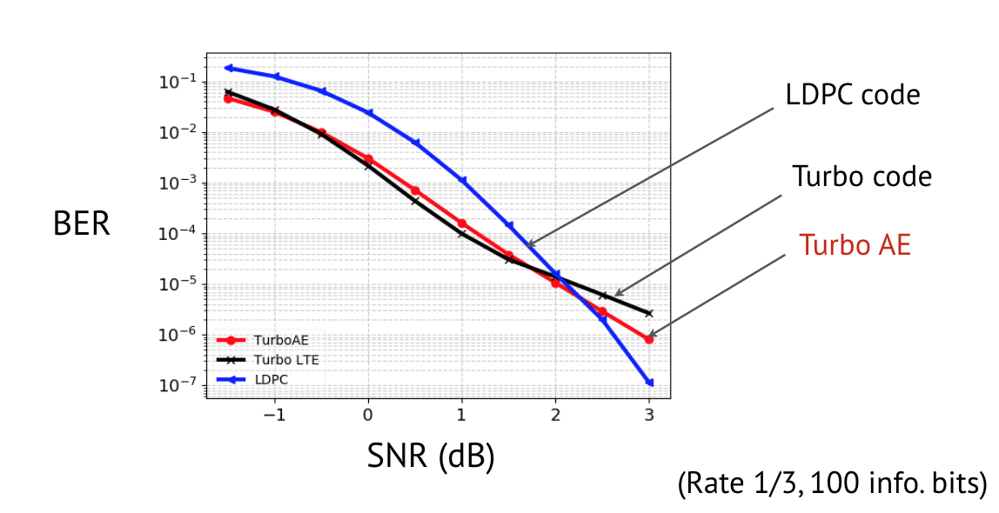

# Turbo AE
Turbo Autoencoder code for paper: `Y. Jiang, H. Kim, H. Asnani, S. Kannan, S. Oh, P. Viswanath, "Turbo Autoencoder: Deep learning based channel code for point-to-point communication channels" Conference on Neural Information Processing Systems (NeurIPS), Vancouver, December 2019`

At medium block length, we can achieve comparable performance to near-optimal codes such as LDPC, Polar, and Turbo Code, solely via gradient descent!

**If you use CNN and RNN as encoder and decoder, you can only get:**

**Use interleaving and iterative decoding, as well as the algorithm shown in more detail in paper, you can have:**

Required library: test on Python 3.6.11+ PyTorch 1.0.

If feel inspired, please consider cite (I will update the link when arxiv version is out.):

    @inproceedings{jiang2019turboae,
      title={Turbo Autoencoder: Deep learning based channel code for point-to-point communication channels},
      author={Jiang, Yihan and Kim, Hyeji and Asnani, Himanshu and Kannan, Sreeram and Oh, Sewoong and Viswanath, Pramod},
      booktitle={NeurIPS 2019},
      pages={},
      year={2019},
      organization={Vancouver}
    }

Feel free to ask me any question! yij021@uw.edu

# What is new (10/18/2019): 
## 1. Drafty paper (main.pdf and supplement.pdf) put in  [here](https://github.com/yihanjiang/turboae/blob/master/docs/) 
Camera-ready paper under construction. Slides under construction.

## 2. Pre-trained model under refining. 
Current *.pt in './models/' are not the best model. (But you can fine-tune them easily) 

## 3. A document for guiding replicate results from scratch is [here](https://github.com/yihanjiang/turboae/blob/master/docs/howtos.md)

# Run experiment examples:

(1) Test pre-trained model, just enforce `-num_epoch 0`:

    CUDA_VISIBLE_DEVICES=0 python3.6 main.py -encoder TurboAE_rate3_cnn -decoder TurboAE_rate3_cnn -enc_num_unit 100 -enc_num_layer 2 -dec_num_unit 100 -dec_num_layer 5 -num_iter_ft 5 -channel awgn -num_train_dec 5 -num_train_enc 1 -code_rate_k 1 -code_rate_n 3 -train_enc_channel_low 2.0 -train_enc_channel_high 2.0  -snr_test_start -1.5 -snr_test_end 4.0 -snr_points 12 -num_iteration 6 -is_parallel 1 -train_dec_channel_low -1.5 -train_dec_channel_high 2.0 -is_same_interleaver 1 -dec_lr 0.0001 -enc_lr 0.0001 -num_block 50000 -batch_size 500 -train_channel_mode block_norm -test_channel_mode block_norm -num_epoch 100 --print_test_traj -loss bce -init_nw_weight ./models/dta_cont_cnn2_cnn5_enctrain2_dectrainneg15_2.pt -num_epoch 0

(2) Train from scratch: Expect to run for 1-1.5 days on Nvidia 1080Ti.

    CUDA_VISIBLE_DEVICES=0 python3.6 main.py -encoder TurboAE_rate3_cnn -decoder TurboAE_rate3_cnn -enc_num_unit 100 -enc_num_layer 2 -dec_num_unit 100 -dec_num_layer 5 -num_iter_ft 5 -channel awgn -num_train_dec 5 -num_train_enc 1 -code_rate_k 1 -code_rate_n 3 -train_enc_channel_low 2.0 -train_enc_channel_high 2.0  -snr_test_start -1.5 -snr_test_end 4.0 -snr_points 12 -num_iteration 6 -is_parallel 1 -train_dec_channel_low -1.5 -train_dec_channel_high 2.0 -is_same_interleaver 1 -dec_lr 0.0001 -enc_lr 0.0001 -num_block 50000 -batch_size 500 -train_channel_mode block_norm -test_channel_mode block_norm -num_epoch 100 --print_test_traj -loss bce 

(3) Fine-tune on trained model:

    CUDA_VISIBLE_DEVICES=0 python3.6 main.py -encoder TurboAE_rate3_cnn -decoder TurboAE_rate3_cnn -enc_num_unit 100 -enc_num_layer 2 -dec_num_unit 100 -dec_num_layer 5 -num_iter_ft 5 -channel awgn -num_train_dec 5 -num_train_enc 1 -code_rate_k 1 -code_rate_n 3 -train_enc_channel_low 2.0 -train_enc_channel_high 2.0  -snr_test_start -1.5 -snr_test_end 4.0 -snr_points 12 -num_iteration 6 -is_parallel 1 -train_dec_channel_low -1.5 -train_dec_channel_high 2.0 -is_same_interleaver 1 -dec_lr 0.0001 -enc_lr 0.0001 -num_block 50000 -batch_size 500 -train_channel_mode block_norm -test_channel_mode block_norm -num_epoch 100 --print_test_traj -loss bce -init_nw_weight ./models/dta_cont_cnn2_cnn5_enctrain2_dectrainneg15_2.pt

(4) Using binarized code via STE:

    CUDA_VISIBLE_DEVICES=0 python3.6 main.py -encoder TurboAE_rate3_cnn -decoder TurboAE_rate3_cnn -enc_num_unit 100 -enc_num_layer 2 -dec_num_unit 100 -dec_num_layer 5 -num_iter_ft 5 -channel awgn -num_train_dec 5 -num_train_enc 1 -code_rate_k 1 -code_rate_n 3 -train_enc_channel_low 2.0 -train_enc_channel_high 2.0  -snr_test_start -1.5 -snr_test_end 4.0 -snr_points 12 -num_iteration 6 -is_parallel 1 -train_dec_channel_low -1.5 -train_dec_channel_high 2.0 -is_same_interleaver 1 -dec_lr 0.0001 -enc_lr 0.0001 -num_block 50000 -batch_size 500 -train_channel_mode block_norm_ste -test_channel_mode block_norm_ste -num_epoch 100 --print_test_traj -loss bce -init_nw_weight ./models/dta_step2_cnn2_cnn5_enctrain2_dectrainneg15_2.pt

Note that `block_norm_ste` will enforce this.
